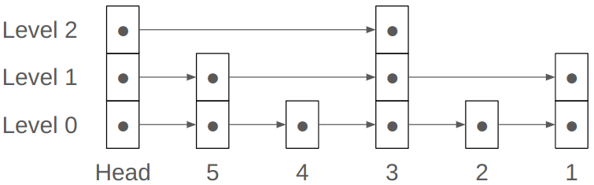
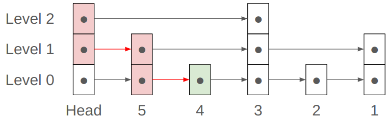
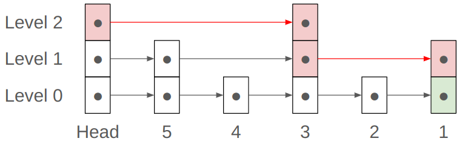

## Problem Description

When using linked lists to store ordered elements, a big disadvantage (over ordered arrays) is that searching for an element cannot be done efficiently with binary search because it is difficult to efficiently access the "mid-point" of a linked list. The skip list is here for rescue! In this problem, we ask you to implement the skip list (which includes an ordered linked list in its bottom layer). 

The following description of the skip list is modified from Wikipedia (http://en.wikipedia.org/wiki/Skip_list): 


*A skip list is built in layers. The bottom (zero-th) layer is an ordinary ordered linked list. Each higher layer acts as an "express lane" for the lists below, where a node in layer $i$ appears in layer $i+1$ with probability $\frac{1}{2}$.* 

*A search for a target node begins at the head in the top list, and proceeds horizontally until the current node is greater than or equal to the target. If the current node is equal to the target, it has been found. If the current node is greater than the target, or the search reaches the end of the linked list, the procedure is repeated after returning to the previous node and dropping down vertically to the next lower list.* 

Note that the nodes in the upper layers act like access points to the "mid-point" in some sense, therefore facilitating rapid search. 

In this problem, we ask you to implement the $\textit{reversely}$ ordered skip list. That is, the skip list is ordered from the largest number to the smallest one. Here are the $4+1$ routines that we ask you to implement

$\texttt{SlowGet(L, data)}$

```python
node <- L[0].head  # the bottom layer, which is simply a reversely ordered linked list
while node != nil and data < node.value
  	node <- node.next
if node.value = data
  	return node
else
		return nil
```

$\texttt{FastGet(L, data)}$

```python
node <- L[L.fastLayers].head  # the top layer
while node.below != nil
		while node.next != nil and data <= node.next.value
  			node <- node.next
  	node <- node.below
return node
```

$\texttt{Insert(L, data)}$

Insertion can be done by first taking $\texttt{FastGet}$ while storing the "previous" node of each layer. Then, one can insert the new node after the "previous" node of each layer probabilistically. Note that if a node
is inserted into the top layer, then an additional coin flipping is needed to see if one more layer should be added. 


To make insertion deterministic (which facilitates the judge system to do grading), please use the following $\texttt{CoinFlip}$ routine to determine whether a number $k$ should be inserted into the $i$-th layer for $i > 0$.

$$
\texttt{CoinFlip(k, i)}=\texttt{IsOdd($\lfloor{k / 2^{i-1}}\rfloor$)}
$$
$\texttt{Remove(L, data)}$

Removal can be done by first taking $\texttt{FastGet}$ and removing the target nodes (in all layers) once they have been found. Note that if all nodes in the top layer are removed, remember to remove the top layer by updating $L.FastLayers$. 

### Input

Assuming that the skip list is empty initially. The first line includes one integer, $M$, representing the number of operations. The next $M$ lines include $2$ integers, $t$ and $k$. The first integer, $t$, represents the operation type:

- Type $1$ is for the $\texttt{SlowGet}$ operation.  You need to find the smallest number that is greater than or equal to $k$ by running the $\texttt{SlowGet}$ function described above.
- Type $2$ is for the $\texttt{FastGet}$ operation. You need to find the smallest number that is greater than or equal to $k$ by running the $\texttt{FastGet}$ function described above.
- Type $3$ is for the $\texttt{Insert}$ operation. You are required to insert $k$ into the skip list. 
- Type $4$ is for the $\texttt{Remove}$ operation. You are required to remove $k$ from the skip list. If~$k$ is not in the skip list, simply ignore it and proceed to the next operation.

### Output

For each $\texttt{SlowGet}$ and $\texttt{FastGet}$ operation, if there is some number that is greater than or equal to $k$ in the skip list, please print the values of $\textbf{all}$ nodes that have been accessed during the searching process in one line. Otherwise, please output $\texttt{-1}$ in one line.

### Constraints

- $1 \leq M \leq 10^5$
- $0\leq k \leq 10^{18}$
- $t\in\{1, 2, 3, 4\}$
- It is ensured that there are no duplicate numbers in the skip list at any given time, but a number may be re-inserted after being removed.

## Subtasks
### Subtask 1 (20 pts)

- $t\in\{1, 3, 4\}$
- $1 \leq M \leq 3\times10^3$
- The two constraints mean that the task can be solved with the bottom layer of a skip list, a typical linked list, or even an array.

### Subtask 2 (40 pts)
\item $t\in\{2, 3\}$, i.e., skip list without $\texttt{Remove}$

### Subtask 3 (40 pts)
\item $t\in\{2, 3, 4\}$, i.e., a fully functional skip list

## Sample Testcases
### Sample Input 1
```
6
3 7
3 14
3 49
1 10
1 7
1 50
```
### Sample Output 1
```
49 14 
49 14 7 
-1
```
### Sample Input 2 
```
8
3 1
3 2
3 3
3 4
3 5
1 1
2 4
2 1
```
### Sample Output 2
```
5 4 3 2 1 
5 5 4 
3 3 1 1
```
### Sample Input 3
```
9
3 7
3 14
3 49
2 7
4 7
2 7
4 14
4 49
2 7
```
### Sample Output 3
```
7 7 7 7 
49 49 14 
-1
```

## Hints

In Sample 2, after completing all insertions, the skip list depicted in Figure 1 will be obtained.



<center> ▲ Figure 1 </center>


When we perform the $\texttt{FastGet}$ operation for number $4$, we traverse through the header in both levels $2$ and $1$, then through $5$ in both levels $1$ and $0$, and finally through $4$ in level 0. As a result, you should output \textsc{5 5 4}. The search path is shown in Figure 2. 



<center> ▲ Figure 2 </center>

Similarly, when we perform the $\texttt{FastGet}$ operation for number $1$, we traverse through the header in level $2$, then through $3$ in both levels $2$ and $1$, and finally through $1$ in both levels $1$ and $0$. As a result, you should output \textsc{3 3 1 1}. The search path is shown in Figure 3. 



<center> ▲ Figure 3 </center>

Last but not least, while we illustrate the skip list with singly-linked lists, there is nothing that prevents you from implementing it with doubly-linked lists (if that is easier for you and you can control the memory usage to be within the limit).
